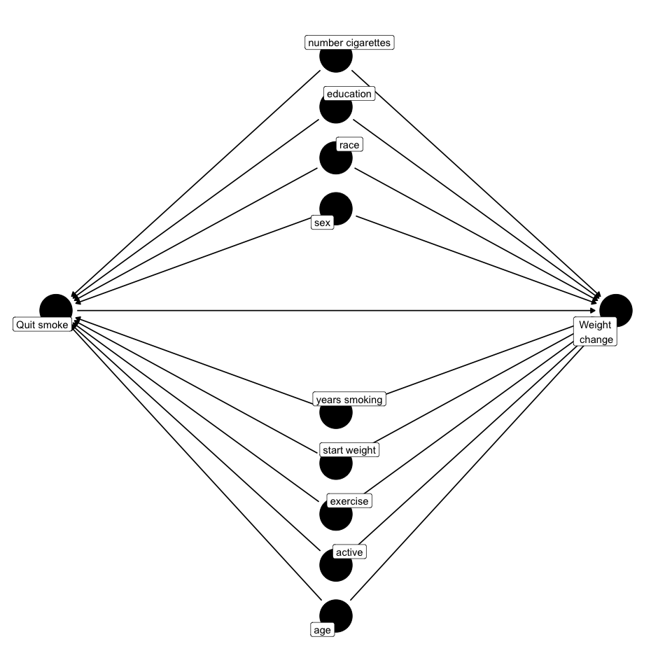

<!-- README.md is generated from README.Rmd. Please edit that file -->

# CarefullyCausal

<!-- badges: start -->
<!-- badges: end -->

The goal of CarefullyCausal is to provide the user a practical guide
when doing causal analyses. Particularly, CarefullyCausal provides the
user the estimand, a table of causal estimates, a discussion on the
causal assumptions, relevant diagnostics and
interpretations/explanations. The key aspects of a causal analysis are
printed and discussed in detail to help the user evaluate whether the
estimated effects can be interpreted as being causal. Currently,
CarefullyCausal can be used in a setting with a fixed-exposure, meaning
that the exposure does not vary over time.  

Some key features:  

- **Setting**: Fixed-exposure
- **Outcome of interest**: can be dichotomous or continuous
- **Exposure of interest**: can be dichotomous, multi-value (max 4
  levels) or continuous
- **Effect measures**: can be in log(odds), risk ratio or odds ratio

## Installation

You can install the development version of CarefullyCausal as follows:

``` r
# To download R packages from Github or other sources we need the "devtools" package
install.packages("devtools")
library("devtools")

# Now we can download the CarefullyCausal package
install_github("mauricekorf/CarefullyCausal")
library(CarefullyCausal)
```

## Example

To develop some intuition with the CarefullyCausal function and to
highlight some important features, an example is step-by-step
illustrated using the NHEFS[^1] data set.

### Research Question

Suppose that we are interested in the causal relation between quitting
smoking and weight change (in Kilograms). Specifically,we would like to
know the effect of quitting smoking on someone’s weight change during
the period 1971-1982 where the first measurement took place in 1971 and
the second one in 1982. Suppose further that, in order to evaluate this
causal relation, we assume that there are some important confounders we
need to adjust for, which includes:  
sex, race, age, education level, smoke intensity (number of cigarettes
per day), how long someone has been smoking ( in years), start weight
(in Kilograms), how much someone exercises (**0:** much exercise, **1:**
moderate exercise, **2:** no exercise) and how active a person is on a
usual day (**0:** very active, **1:** moderately active, **2:**
inactive)

<br> Given that we assume that these are the only confounders and that
no collider bias or selection bias is induced, we would obtain the
following simple Directed Acyclic Graph (DAG):
<p align="center">

</p>
<center>
<i>Figure 1: </i>The selected variables are for illustration purposes
only. The DAG shows by no means the true causal structure
</center>

<br>

### Data

In order to answer our research question, we will use a subset of the
NHEFS data set from Hernán MA & Robins JM (2020) in the *Causal
inference: What if* book[^2]. To conveniently import this data set we
will use the package *causaldata*.

``` r
# Download the required package, containing various (causal) data sets
install.packages("causaldata")
library(causaldata)

# Load in the data, we will use the complete cases variant
df = nhefs_complete
```

<br>

We will now select the variables that we deemed to be relevant, as shown
in Figure 1 (DAG). We show the first six rows of the data set below, to
get an idea of the data set.

``` r
# Select variables
df = nhefs_complete[,c("wt82_71","qsmk","race","sex","education","smokeintensity", "smokeyrs","wt71","exercise","active", "age")]
```

<table>
<thead>
<tr>
<th style="text-align:right;">
wt82_71
</th>
<th style="text-align:right;">
qsmk
</th>
<th style="text-align:left;">
race
</th>
<th style="text-align:left;">
sex
</th>
<th style="text-align:left;">
education
</th>
<th style="text-align:right;">
smokeintensity
</th>
<th style="text-align:right;">
smokeyrs
</th>
<th style="text-align:right;">
wt71
</th>
<th style="text-align:left;">
exercise
</th>
<th style="text-align:left;">
active
</th>
<th style="text-align:right;">
age
</th>
</tr>
</thead>
<tbody>
<tr>
<td style="text-align:right;">
-10.093960
</td>
<td style="text-align:right;">
0
</td>
<td style="text-align:left;">
1
</td>
<td style="text-align:left;">
0
</td>
<td style="text-align:left;">
1
</td>
<td style="text-align:right;">
30
</td>
<td style="text-align:right;">
29
</td>
<td style="text-align:right;">
79.04
</td>
<td style="text-align:left;">
2
</td>
<td style="text-align:left;">
0
</td>
<td style="text-align:right;">
42
</td>
</tr>
<tr>
<td style="text-align:right;">
2.604970
</td>
<td style="text-align:right;">
0
</td>
<td style="text-align:left;">
0
</td>
<td style="text-align:left;">
0
</td>
<td style="text-align:left;">
2
</td>
<td style="text-align:right;">
20
</td>
<td style="text-align:right;">
24
</td>
<td style="text-align:right;">
58.63
</td>
<td style="text-align:left;">
0
</td>
<td style="text-align:left;">
0
</td>
<td style="text-align:right;">
36
</td>
</tr>
<tr>
<td style="text-align:right;">
9.414486
</td>
<td style="text-align:right;">
0
</td>
<td style="text-align:left;">
1
</td>
<td style="text-align:left;">
1
</td>
<td style="text-align:left;">
2
</td>
<td style="text-align:right;">
20
</td>
<td style="text-align:right;">
26
</td>
<td style="text-align:right;">
56.81
</td>
<td style="text-align:left;">
2
</td>
<td style="text-align:left;">
0
</td>
<td style="text-align:right;">
56
</td>
</tr>
<tr>
<td style="text-align:right;">
4.990117
</td>
<td style="text-align:right;">
0
</td>
<td style="text-align:left;">
1
</td>
<td style="text-align:left;">
0
</td>
<td style="text-align:left;">
1
</td>
<td style="text-align:right;">
3
</td>
<td style="text-align:right;">
53
</td>
<td style="text-align:right;">
59.42
</td>
<td style="text-align:left;">
2
</td>
<td style="text-align:left;">
1
</td>
<td style="text-align:right;">
68
</td>
</tr>
<tr>
<td style="text-align:right;">
4.989251
</td>
<td style="text-align:right;">
0
</td>
<td style="text-align:left;">
0
</td>
<td style="text-align:left;">
0
</td>
<td style="text-align:left;">
2
</td>
<td style="text-align:right;">
20
</td>
<td style="text-align:right;">
19
</td>
<td style="text-align:right;">
87.09
</td>
<td style="text-align:left;">
1
</td>
<td style="text-align:left;">
1
</td>
<td style="text-align:right;">
40
</td>
</tr>
<tr>
<td style="text-align:right;">
4.419060
</td>
<td style="text-align:right;">
0
</td>
<td style="text-align:left;">
1
</td>
<td style="text-align:left;">
1
</td>
<td style="text-align:left;">
2
</td>
<td style="text-align:right;">
10
</td>
<td style="text-align:right;">
21
</td>
<td style="text-align:right;">
99.00
</td>
<td style="text-align:left;">
1
</td>
<td style="text-align:left;">
1
</td>
<td style="text-align:right;">
43
</td>
</tr>
</tbody>
</table>

<br>

To further inspect the variable coding and the corresponding definition,
a table is created below which also includes the class of the variable.
<center>
<table>
<thead>
<tr>
<th style="text-align:left;">
variable
</th>
<th style="text-align:left;">
class
</th>
<th style="text-align:left;">
description
</th>
</tr>
</thead>
<tbody>
<tr>
<td style="text-align:left;">
wt82_71
</td>
<td style="text-align:left;">
numeric
</td>
<td style="text-align:left;">
The weight change between 1971 and 1982 in Kg
</td>
</tr>
<tr>
<td style="text-align:left;">
qsmk
</td>
<td style="text-align:left;">
numeric
</td>
<td style="text-align:left;">
Quit smoking during 1971-1982, 1: yes, 0: no
</td>
</tr>
<tr>
<td style="text-align:left;">
race
</td>
<td style="text-align:left;">
factor
</td>
<td style="text-align:left;">
1: black or other, 0: white,
</td>
</tr>
<tr>
<td style="text-align:left;">
sex
</td>
<td style="text-align:left;">
factor
</td>
<td style="text-align:left;">
1: female, 0: male
</td>
</tr>
<tr>
<td style="text-align:left;">
education
</td>
<td style="text-align:left;">
factor
</td>
<td style="text-align:left;">
1: 8th grade, 2: HS dropout, 3: HS, 4: college dropout, 5: college or
higher
</td>
</tr>
<tr>
<td style="text-align:left;">
smokeintensity
</td>
<td style="text-align:left;">
numeric
</td>
<td style="text-align:left;">
Number of cigarettes smoked per day in 1971
</td>
</tr>
<tr>
<td style="text-align:left;">
smokeyrs
</td>
<td style="text-align:left;">
numeric
</td>
<td style="text-align:left;">
Years of smoking
</td>
</tr>
<tr>
<td style="text-align:left;">
wt71
</td>
<td style="text-align:left;">
numeric
</td>
<td style="text-align:left;">
Start weight (Kg) in 1971
</td>
</tr>
<tr>
<td style="text-align:left;">
exercise
</td>
<td style="text-align:left;">
factor
</td>
<td style="text-align:left;">
In recreation in 1971 how mu h exercising, 0: much, 1: moderate, 2:
little or none
</td>
</tr>
<tr>
<td style="text-align:left;">
active
</td>
<td style="text-align:left;">
factor
</td>
<td style="text-align:left;">
On usual day how active in 1971, 0: very active, 1: moderately active,
2: inactive
</td>
</tr>
<tr>
<td style="text-align:left;">
age
</td>
<td style="text-align:left;">
numeric
</td>
<td style="text-align:left;">
Age in 1971
</td>
</tr>
</tbody>
</table>
</center>

<br>

### Analysis (Applying CarefullyCausal)

We will now shift our focus to actually using the CarefullyCausal
function. The minimal call requires us to specify the following
arguments: `formula, data, family` and `exposure`. Note that you can
always consult the help file within R to see the documentation of
CarefullyCausal and to learn about all available arguments including an
explanation. You can access this by simply typing in *CarefullyCausal*
in the help tab in R. Nonetheless, we summarise the key arguments we
need for the minimal call.

- `Formula`, this has the same form as for example when using *glm*
  which is $y\sim x + \boldsymbol{w}$. Here $y$ denotes the outcome of
  interest variable, $x$ denotes the exposure and $\boldsymbol{w}$ are
  covariates we want to adjust for. The $y$ variable should be a numeric
  vector, $x$ should be a factor when exposure is discrete and
  adjustment variables $\boldsymbol{w}$ can be any class
- `Data`, specify the data frame (data set should be a data frame)
- `Family`, this is the same as in *glm* where it describes the error
  distribution and link function. Here we have two choices: `"gaussian"`
  or `"binomial"`. This depends on the nature of the outcome of
  interest. In our example the outcome is continuous and thus we use the
  `"gaussian"` argument (default setting)
- `Exposure`, we explicitly define our exposure variable as a character
  string. In this example, it will be `"qsmk"`

``` r
# Transform exposure in a factor variable and transform into dataframe
df$qsmk = as.factor(df$qsmk) 
df = as.data.frame(df)

# Run the CarefullyCausal function and save it in the object "output"
output <- CarefullyCausal(wt82_71 ~ qsmk + race + sex + education + smokeintensity + smokeyrs + wt71 + exercise
                          + active + age,
                          data = df,
                          exposure = "qsmk",
                          family = "gaussian")
# Print the output
output
#> 
#> Estimand: 
#> Conditional 
#> E[wt82_71^qsmk=1|race, sex, education, smokeintensity, smokeyrs, wt71, exercise, active, age]  -  E[wt82_71^qsmk=0|race, sex, education, smokeintensity, smokeyrs, wt71, exercise, active, age]
#> 
#> Marginal 
#> E[wt82_71^qsmk=1]  -  E[wt82_71^qsmk=0]
#> *Please see output at $Estimand_interpretation for details 
#>  
#> 
#> Treatment effect: 
#>                          Estimate Std. Error S-value 95%.CI.lower 95%.CI.upper
#> qsmk1 outcome regression    3.381      0.441  44.858        2.517        4.246
#> qsmk1 IPTW                  3.318      0.494  35.198        2.351        4.286
#> qsmk1 S-standardization     3.381      0.474     Inf        2.464        4.320
#> qsmk1 T-standardization     3.448      0.500     Inf        2.406        4.366
#> qsmk1 TMLE                  3.370      0.494     Inf        2.401        4.339
#> 
#> Reference exposure level: 0 
#> 
#> 
#> Please evaluate whether the difference beteen the lowest estimate: 3.3183 and highest: 3.4482 is of substance, 
#> given the nature of the data. If so, evaluate the different modelling assumptions.
#> 
#> 
#> To interpret these effects as causal, the following key assumptions must be satisfied: 
#> 
#> [1] Conditional exchangeability: implies that adjusting for "race, sex, education, smokeintensity, smokeyrs, wt71, exercise, active, age" is enough to completely eliminate 
#> all confounding and selection bias. See the covariate balance table ($Assumptions$exchangeability$covariate_balance) 
#> in the saved output and the corresponding explanations ($Assumptions$exchangeability$explanation). 
#> 
#> [2] Positivity: is satisfied when both exposed and unexposed individuals are observed within every stratum of variables adjusted for ( race, sex, education, smokeintensity, smokeyrs, wt71, exercise, active, age ). This can be evaluated using the propensity plots saved in the output at $Assumptions$positivity$plots (or identically use the ps.plot() function), the table below ($Assumptions$positivity$ps_table) and the corresponding explanation found at $Assumptions$positivity$explanation. Note: PS=propensity score 
#>  
#>                        PS range for 1
#> observed exposure: 0   0.0338, 0.6520
#> observed exposure: 1   0.0685, 0.7709
#> 
#> [3] Consistency: implies that exposure 'qsmk' must be sufficiently well-defined so that any variation within 
#> the definition of the exposure would not result in a different outcome. See $Assumption$consistency 
#> for a more in-depth explanation and examples. 
#> 
#> [4] No measurement error: assumes that all variables were measured without substantial error, such that
#> no substantial measurement bias is present. However, if the presence of substantial measurement bias is plausible, 
#> then the estimated effects should be carefully reconsidered as being causal effects. See $Assumptions$no_measurement_error 
#> for a further discussion 
#> 
#> [5] Well-specified models: assumes that any models used are well-specified meaning that they include all
#> relevant non-linearities and/or statistical interactions
```

<br>

The output of the CarefullyCausal function is shown above and can be
broadly classified into the sections: estimand, estimators and
assumptions/diagnostics. We go over each part now in more detail.

##### Estimand

The first lines in the output show the *estimand*, which is a precise
description of your research question and should be defined before the
analyses. Defining the estimand requires the user to think through many
aspects, such as the population in which the research question is being
asked, the duration and timing of exposure, the definition of the
exposure and so on. Printing the estimand in the R output might ideally
be considered as redundant, post-analysis, as it can inform us only
about basic characteristics. Particularly, the estimand targeted by the
user which is printed in R can only inform us about the exposure
variable, outcome variable, adjustment set and counterfactual contrast.
Nonetheless, the idea of explicitly showing the estimand might serve as
a reminder for the user to think through whether there is any
discrepnancy between the actual estimated effect and the question of
interest and motivates the user to double-check the pre-analysis part of
thinking through the research question and corresponding estimand. In
addition, the estimand uses counterfactual notation and therewith
emphasizes that we are interested in causal effects without ambiguity.
We provide both a conditional and marginal estimand since we provide
different estimators and different type of estimands correspond to
different estimators. In essence, the idea of the estimand is the same
but due to more technical reasons (how the estimators work) we write the
estimand in a conditional or marginal way. Important to note is that the
marginal estimand is still adjusting for all the variables like shown in
the conditional estimand, but we do not write the adjusted variables
explicitly in the marginal estimand. To learn more about estimands and
its formulation see: [^3] [^4] [^5]

``` r
#> Estimand: 
#> Conditional 
#> E[wt82_71^qsmk=1|race, sex, education, smokeintensity, smokeyrs, wt71, exercise, active, age]  - E[wt82_71^qsmk=0|race, sex, education, smokeintensity, smokeyrs, wt71, exercise, active, age]
#> 
#> Marginal 
#> E[wt82_71^qsmk=1]  -  E[wt82_71^qsmk=0]
#> *Please see output at $Estimand_interpretation for details 
```

<br>

We can obtain a description of the estimand from the saved output. In
this example the CarefullyCausal output was saved in the object named
*output*. Hence, we call this specific output object.

``` r
# Show saved output from $Estimand_interpretation
output$Estimand_interpretation

#> [1] "The estimand shows the average causal effect in the population of interest given the different exposure
#> regimes. More specifically, the effect of receiving exposure level 1 with respect to the reference exposure
#> level 0. When adjusting for a set of covariates (race, sex, education, smokeintensity, smokeyrs, wt71,
#> exercise, active, age) the estimand is displayed in either a conditional or marginal way. Particularly,
#> defining the estimand depends on the approach/model used. For example, outcome regression has a conditional
#> estimand while IPTW has a marginal estimand. The T-standardization approach also has a marginal estimand
#> while for the S-standardization it depends on whether interactions between treatment and covariates are
#> taken into account. When no interactions are considered, then it is the same as outcome regression and
#> thus has a conditional estimand, however when all interactions are considered then it is like
#> T-standardization and thus has a marginal estimand."
```

<br>

##### Estimators

After displaying the estimand, different estimators are shown in a table
with corresponding estimates, standard errors, s-values and 95%
confidence intervals. The p-values can also be shown by setting
`pvalue=TRUE`, but is hidden by default. The S-value is a transformation
of the p-value by applying $-log_2(p-value)$. The S-value is continuum
and ranges from 0 to infinity, where a p-value of 1 corresponds to a
S-value of 0 and a p-value of 0 corresponds to a S-value approaching
infinity. Intuitively, the S-value captures the amount of information in
the data against the model and quantifies how *suprised* we can be about
a specific outome. In other words, a very high S-value implies that we
would be suprised by the findings we found, given all background
assumptions and test hypotheses. Showing the S-value by default rather
than the p-value is motivated by that in practice a lot of studies
dichotomize settings based on a single cut-off value (e.g $0.05$) where
below that value it is interpreted as *useful* and above it is
interpreted as *not useful*. In this way the focus is generally purely
on the statistical significance and tends to result in
underacknowledgment of the practical significance.[^6] [^7] [^8]

CarefullyCausal currently supports five different estimators, as shown
below, where key characteristics are listed below:

- *Outcome Regression*: for outcome regression `glm` is implemented.
  When `family = "gaussian"` linear regression is by default performed
  and when `family = "binomial"` logistic regression will be
  implemented.
- *Inverse Probability Treatment Weighting (IPTW)*: Propensity scores
  are estimated using the `CBPS` package, which are *Covariate Balancing
  Propensity Scores*[^9]. Technical details about how *CBPS* works can
  be found for binary exposure[^10], for multi-value exposure[^11] and
  for continuous exposure[^12]. Based on the estimated propensity
  scores, *non-stabilized* weights (*IP weights*) will be computed.
  Subsequently, the `svyglm` function from the `survey` package is used
  to run a weighted glm with the IP weights to get the correct
  corresponding standard errors. By default `CBPS` is implemented, but
  the user can also input their own *IP weights* as a vector using the
  `ip_weights_iptw` argument and offers full flexibility.
- *S-and-T-standardization*: these two approaches are generally referred
  within the causal inference literature to the broad approach of
  *standardization* (G-computation). In CarefullyCausal an explicit
  distinction is made between different standardization approaches,
  hence the two different namings. The names are inspired by the machine
  learning literature where similar ideas are generalized and clear
  distinctions are made between different approaches and respectively
  referred to as S-learner and T-learner[^13]. The S-learner and
  T-learner can be viewed as two different standardization approaches
  where the S-learner uses a single model and the T-learner uses two
  models. Specifically, with the S-learner a single model is fitted on
  all data and then the counterfactual effects are predicted under all
  exposure levels using this fitted model. In contrast, the T-learner
  first splits the data based on the exposure variable and then fits a
  model per exposure level (subset of data). Each model is then used to
  predict the counterfactual effects for the entire sample under each
  exposure level. A clear distinction between slightly different
  approaches is preferable, but to make a clear link to the causal
  inference terminology such that it sounds more familiar, we introduced
  the names S-standardization and T-standardization. When using
  S-standardization, the user can add interactions between any covariate
  and the exposure using the `interaction` argument. When no
  interactions are included it will be equivalent to outcome regression
  and when all possible interactions are considered between the
  adjustment set and exposure it is equivalent to T-standardization.
  Currently, CarefullyCausal only supports `glm`. Bootstrapping is used
  to obtain standard errors and p-values and the number of iterations
  are respectively controlled by arguments `boot1` and `boot2`.
  Moreover, a normal confidence interval or bias-corrected accelerated
  confidence interval can be computed and specified using the
  `confidence` argument. Note that these estimators do support
  continuous exposures.
- *Targeted Maximum Likelihood Estimation (TMLE)*: TMLE is a two-stage
  estimation procedure[^14]. First, there is the g-estimation part which
  is just like S-standardization where we model the outcome of interest.
  The default within the TMLE framework is to use the `SuperLearner`
  function from the `SuperLearner` package. In CarefullyCausal we also
  integrated `SuperLearner` for this step and the user can specify the
  algorithm library using the `outcome_SL_library` argument using the
  exact same format as in the `SuperLearner` function. The default is
  that the library only includes `c("SL.glm")` and thus implies that
  simply glm is used. The second stage updates the model from the first
  stage by incorporating information in the treatment assignment
  mechanism and is referred to as the targeting step. For this second
  stage we need to estimate propensity scores and is by default done
  using `SuperLearner`. Within CarefullyCausal this is also the default
  option where `ps_method="SL"` and the same algorithm library is used
  as specified for stage one and thus follows argument
  `outcome_SL_library`. However, the user can specify a different
  library specifically for estimating the propensity scores using
  SuperLearner by using the argument `ps_SL_library`. Besides the option
  of specifying the propensity score estimation library, the user can
  also specify a different formula for estimating the propensity scores
  using argument `ps_formula`. By default, the formula used for
  estimating the propensity scores will be
  $exposure \sim input \ covariates$, meaning it uses all the covariates
  that were input in the initial CarefullyCausal call. However, you can
  fully customize what variables to include or exclude for estimating
  the propensity scores, even variables that were initially not input.
  Besides using `Superlearner` for this estimation step, you can also
  use `CBPS` using argument `ps_method="cbps"`. For complete
  flexibility, you can input your own estimated propensity scores using
  argument `ps_tmle` and if used it will ignore all of the above
  arguments. Note, CarefullyCausal implements currently only tmle for
  dichotomous exposures.

``` r
#> Treatment effect: 
#>                       Estimate Std. Error S-value 95%.CI.lower 95%.CI.upper
#> qsmk1 outcome regression    3.381      0.441  44.858        2.517        4.246
#> qsmk1 IPTW                  3.318      0.494  35.198        2.351        4.286
#> qsmk1 S-standardization     3.381      0.549     Inf        2.194        4.344
#> qsmk1 T-standardization     3.448      0.523     Inf        2.479        4.528
#> qsmk1 TMLE                  3.370      0.494     Inf        2.401        4.339

#> Reference exposure level: 0 


#> Please evaluate whether the difference beteen the lowest estimate: 3.3183 and highest: 3.4482 is of substance, 
#> given the nature of the data. If so, evaluate the different modelling assumptions.
```

<br>

The reference exposure level is explicitly stated below the estimates
table. In addition, the name of the respective exposure level of
interest is added to the estimator’s name (in this example adding
exposure level *“1”*) to avoid any confusion, especially in a
multi-value exposure setting. In a multi-value exposure setting, all
respective causal contrasts with respect to the specified reference
exposure level are shown in the table per estimator. This means that
when having four exposure levels, there are three contrasts shown per
estimator. To change the reference exposure level you need *relevel* the
exposure variable (which should be a factor). CarefullyCausal by
defaults selects the first level as reference level, which is the
default behavior of R as well, where the reference level can be viewed
using argument `level(exposure)`.

The last lines state that you should evaluate whether the difference
between the estimates is of substance or not. Important to note is that
there is *not* a best model, but that you can fit different estimators
to see if they agree and may provide you with a broader context to the
estimate. If all the estimates are very similar it does not guarantuee
that the estimates are unbiased but at least it provides us with more
information than when reporting a single estimate. However, if the
estimates are very different (*depends on the data, domain and
assumptions*) and this is considered to be practically important and not
simply due to random error, then it should be investigated why. This
raises questions such as whether particular modelling assumptions are
violated, how these may be violated and if there is a possible solution.
So, rather than thinking about selecting a *best* model, CarefullyCausal
provides different estimates that correspond to different estimators to
provide you with a broader context and might indicate that further
inspection is necessary. Our advice is to report all estimates, but to
discuss one of the estimates in more detail in terms of interpretation.
In this way, a broader context is also provided to the reader and may
facilitate an informed discussion.

In this example we have a continuous outcome and thus the estimates are
interpreted in the units of the outcome variable (weight change in Kg).
However, when the outcome variable is dichotomous, the default is that
the estimates are in terms of log(odds ratio) but you can specify the
arguments `result_type="rr"` or `result_type="or"` to get it in terms of
risk ratio or odds ratio, respectively. <br> <br>

##### Assumptions and Diagnostics

Key part of causal analyses is evaluating the underlying causal
assumptions in order to form a judgement about to what extent the
estimated effects can be interpreted as being causal. In this part it is
crucial to think through why the assumptions seem plausible to hold as
it helps you justify the causal interpretations. CarefullyCausal
discusses five key underlying causal assumptions including:
(conditional) exchangeability, consistency, positivity, having a
well-specified model and having no measurement errors. In the printed
output a brief description and bold statement is provided regarding what
you are assuming. This should by no means scare you off, but should
motivate you to look into each assumption and to think about arguments
why the assumption does indeed seem plausible to hold. We will now look
into each assumption in more detail and show what useful diagnostics
that are saved in the output may assist you.

``` r
#> To interpret these effects as causal, the following key assumptions must be satisfied: 
#> 
#> [1] Conditional exchangeability: implies that adjusting for "race, sex, education, smokeintensity, smokeyrs, wt71, exercise, active, age" is enough to completely eliminate 
#> all confounding and selection bias. See the covariate balance table ($Assumptions$exchangeability$covariate_balance) 
#> in the saved output and the corresponding explanations ($Assumptions$exchangeability$explanation). 
#> 
#> [2] Positivity: is satisfied when both exposed and unexposed individuals are observed within every stratum of variables adjusted for ( race, sex, education, smokeintensity, smokeyrs, wt71, exercise, active, age ). This can be evaluated using the propensity plots saved in the output at $Assumptions$positivity$plots (or identically use the ps.plot() function), the table below ($Assumptions$positivity$ps_table) and the corresponding explanation found at $Assumptions$positivity$explanation. Note: PS=propensity score 
#>  
#>                        PS range for 1
#> observed exposure: 0   0.0338, 0.6520
#> observed exposure: 1   0.0685, 0.7709
#> 
#> [3] Consistency: implies that exposure 'qsmk' must be sufficiently well-defined so that any variation within 
#> the definition of the exposure would not result in a different outcome. See $Assumption$consistency 
#> for a more in-depth explanation and examples. 
#> 
#> [4] No measurement error: assumes that all variables were measured without substantial error, such that
#> no substantial measurement bias is present. However, if the presence of substantial measurement bias is plausible, 
#> then the estimated effects should be carefully reconsidered as being causal effects. See $Assumptions$no_measurement_error 
#> for a further discussion 
#> 
#> [5] Well-specified models: assumes that any models used are well-specified meaning that they include all
#> relevant non-linearities and/or statistical interactions
```

<br>

###### Conditional Exchangeability

We can obtain a more detailed explanation and interpretation of the
exchangeability assumption from the saved output object.

``` r
# We can obtain an explanation/interpretation from the saved output object named "output"
output$Assumptions$exchangeability$explanation

#> [1] "Conditional exchangeability implies the absence of any confounding or selection bias after adjusting
#> for:  race, sex, education, smokeintensity, smokeyrs, wt71, exercise, active, age . In other words, the
#> exposed group is a perfect representation what would have happened to the unexposed group had they been
#> exposed (and vice versa). The covariate balancing table and corresponding balance plots in the output can
#> be consulted ($Assumptions$exchangeability$covariate_balance) where better balance between the two
#> groups will indicate less residual bias due to the variables adjusted for. Any confounding due to
#> variables not adjusted for will remain. Besides checking the covariate balance of the current adjusted
#> covariates, an important reflective question to be thought-over is: given the current adjusted for
#> covariates, are there any other important (unmeasured) covariates that affect both treatment
#> assignment and outcome of interest that should be adjusted for without inducing collider or
#> selection bias? Next to this conditional setting, we can also have a setting when no covariates
#> are adjusted for and we assume marginal exchangeability. Marginal exchangeability implies the
#> absence of any confounding or selection bias when not adjusting for anything (unconditionally).
#> This is obtained in an ideal randomized experiment design"
```

<br>

Besides the additional explanation/interpretation, we can obtain a
covariate balance table and covariate balance plots from the saved
*output* object. Both are generated using the `cobalt` package.[^15] For
dichotomous and multi-value exposures, the difference in means are
reported. Here *“M.1.Un”* corresponds to the means in the treated group
before adjusting, while *“M.0.Un* refers to the control group before
adjusting. Similarly, *“M.1.Adj”* refers to the means in the treated
after adjusting and the same holds for the control group denoted by
*“M.0.Adj”*. The *“Diff.un”* shows the difference in means between the
treated and control group before adjusting, while *“Diff.Adj* shows this
respectively after adjusting. Note that this difference in means is
standardized for continuous covariates but is not standardized (raw) for
dichtomous covariates, which is the default setting from `cobalt`. Also,
for dichotomous covariates the difference in means actually refers to
the difference in proportions. When the exposure is continuous, we use
correlation-based diagnostics. Specifically, the *treatment-covariate
Pearson correlation* is shown and when the correlation is zero it
implies that the treatment and covariate are independent. The
treatment-covariate Pearson correlation is again displayed before and
after adjusting, where after adjusting is referred to the GPS-weighted
sample (*generalized propensity scores*). Ideally, the correlation
between treatment and any covariate should approach 0 after adjusting as
it implies independency.[^16] However, it should be noted that a
*linear* correlation measure is used and thus it only measures *linear
dependence* and does not capture non-linear relations.

``` r
# We can obtain the covariate balance table from the saved output object named "output"
output$Assumptions$exchangeability$covariate_balance
```

<table>
<caption>
Balance Measures
</caption>
<thead>
<tr>
<th style="text-align:left;">
</th>
<th style="text-align:left;">
Type
</th>
<th style="text-align:right;">
M.0.Un
</th>
<th style="text-align:right;">
M.1.Un
</th>
<th style="text-align:right;">
Diff.Un
</th>
<th style="text-align:right;">
M.0.Adj
</th>
<th style="text-align:right;">
M.1.Adj
</th>
<th style="text-align:right;">
Diff.Adj
</th>
</tr>
</thead>
<tbody>
<tr>
<td style="text-align:left;">
prop.score
</td>
<td style="text-align:left;">
Distance
</td>
<td style="text-align:right;">
0.2417253
</td>
<td style="text-align:right;">
0.3021265
</td>
<td style="text-align:right;">
0.5368600
</td>
<td style="text-align:right;">
0.2591321
</td>
<td style="text-align:right;">
0.2567410
</td>
<td style="text-align:right;">
-0.0212524
</td>
</tr>
<tr>
<td style="text-align:left;">
race
</td>
<td style="text-align:left;">
Binary
</td>
<td style="text-align:right;">
0.1461737
</td>
<td style="text-align:right;">
0.0893300
</td>
<td style="text-align:right;">
-0.0568437
</td>
<td style="text-align:right;">
0.1311683
</td>
<td style="text-align:right;">
0.1311622
</td>
<td style="text-align:right;">
-0.0000060
</td>
</tr>
<tr>
<td style="text-align:left;">
sex
</td>
<td style="text-align:left;">
Binary
</td>
<td style="text-align:right;">
0.5339639
</td>
<td style="text-align:right;">
0.4540943
</td>
<td style="text-align:right;">
-0.0798696
</td>
<td style="text-align:right;">
0.5113079
</td>
<td style="text-align:right;">
0.5113118
</td>
<td style="text-align:right;">
0.0000039
</td>
</tr>
<tr>
<td style="text-align:left;">
education_1
</td>
<td style="text-align:left;">
Binary
</td>
<td style="text-align:right;">
0.1805675
</td>
<td style="text-align:right;">
0.2009926
</td>
<td style="text-align:right;">
0.0204251
</td>
<td style="text-align:right;">
0.1813769
</td>
<td style="text-align:right;">
0.1813580
</td>
<td style="text-align:right;">
-0.0000190
</td>
</tr>
<tr>
<td style="text-align:left;">
education_2
</td>
<td style="text-align:left;">
Binary
</td>
<td style="text-align:right;">
0.2287188
</td>
<td style="text-align:right;">
0.1836228
</td>
<td style="text-align:right;">
-0.0450960
</td>
<td style="text-align:right;">
0.2179699
</td>
<td style="text-align:right;">
0.2179589
</td>
<td style="text-align:right;">
-0.0000111
</td>
</tr>
<tr>
<td style="text-align:left;">
education_3
</td>
<td style="text-align:left;">
Binary
</td>
<td style="text-align:right;">
0.4127257
</td>
<td style="text-align:right;">
0.3895782
</td>
<td style="text-align:right;">
-0.0231475
</td>
<td style="text-align:right;">
0.4041580
</td>
<td style="text-align:right;">
0.4041876
</td>
<td style="text-align:right;">
0.0000296
</td>
</tr>
<tr>
<td style="text-align:left;">
education_4
</td>
<td style="text-align:left;">
Binary
</td>
<td style="text-align:right;">
0.0791058
</td>
<td style="text-align:right;">
0.0719603
</td>
<td style="text-align:right;">
-0.0071455
</td>
<td style="text-align:right;">
0.0804544
</td>
<td style="text-align:right;">
0.0804462
</td>
<td style="text-align:right;">
-0.0000082
</td>
</tr>
<tr>
<td style="text-align:left;">
education_5
</td>
<td style="text-align:left;">
Binary
</td>
<td style="text-align:right;">
0.0988822
</td>
<td style="text-align:right;">
0.1538462
</td>
<td style="text-align:right;">
0.0549640
</td>
<td style="text-align:right;">
0.1160408
</td>
<td style="text-align:right;">
0.1160494
</td>
<td style="text-align:right;">
0.0000086
</td>
</tr>
<tr>
<td style="text-align:left;">
smokeintensity
</td>
<td style="text-align:left;">
Contin.
</td>
<td style="text-align:right;">
21.1917455
</td>
<td style="text-align:right;">
18.6029777
</td>
<td style="text-align:right;">
-0.2166746
</td>
<td style="text-align:right;">
20.5519894
</td>
<td style="text-align:right;">
20.5504753
</td>
<td style="text-align:right;">
-0.0001267
</td>
</tr>
<tr>
<td style="text-align:left;">
smokeyrs
</td>
<td style="text-align:left;">
Contin.
</td>
<td style="text-align:right;">
24.0877042
</td>
<td style="text-align:right;">
26.0322581
</td>
<td style="text-align:right;">
0.1589181
</td>
<td style="text-align:right;">
24.7241755
</td>
<td style="text-align:right;">
24.7246024
</td>
<td style="text-align:right;">
0.0000349
</td>
</tr>
<tr>
<td style="text-align:left;">
wt71
</td>
<td style="text-align:left;">
Contin.
</td>
<td style="text-align:right;">
70.3028375
</td>
<td style="text-align:right;">
72.3548883
</td>
<td style="text-align:right;">
0.1332162
</td>
<td style="text-align:right;">
70.7447292
</td>
<td style="text-align:right;">
70.7457996
</td>
<td style="text-align:right;">
0.0000695
</td>
</tr>
<tr>
<td style="text-align:left;">
exercise_0
</td>
<td style="text-align:left;">
Binary
</td>
<td style="text-align:right;">
0.2037833
</td>
<td style="text-align:right;">
0.1563275
</td>
<td style="text-align:right;">
-0.0474558
</td>
<td style="text-align:right;">
0.1895426
</td>
<td style="text-align:right;">
0.1895168
</td>
<td style="text-align:right;">
-0.0000259
</td>
</tr>
<tr>
<td style="text-align:left;">
exercise_1
</td>
<td style="text-align:left;">
Binary
</td>
<td style="text-align:right;">
0.4170249
</td>
<td style="text-align:right;">
0.4367246
</td>
<td style="text-align:right;">
0.0196996
</td>
<td style="text-align:right;">
0.4303267
</td>
<td style="text-align:right;">
0.4303411
</td>
<td style="text-align:right;">
0.0000144
</td>
</tr>
<tr>
<td style="text-align:left;">
exercise_2
</td>
<td style="text-align:left;">
Binary
</td>
<td style="text-align:right;">
0.3791917
</td>
<td style="text-align:right;">
0.4069479
</td>
<td style="text-align:right;">
0.0277561
</td>
<td style="text-align:right;">
0.3801306
</td>
<td style="text-align:right;">
0.3801421
</td>
<td style="text-align:right;">
0.0000114
</td>
</tr>
<tr>
<td style="text-align:left;">
active_0
</td>
<td style="text-align:left;">
Binary
</td>
<td style="text-align:right;">
0.4574377
</td>
<td style="text-align:right;">
0.4218362
</td>
<td style="text-align:right;">
-0.0356014
</td>
<td style="text-align:right;">
0.4435776
</td>
<td style="text-align:right;">
0.4435609
</td>
<td style="text-align:right;">
-0.0000167
</td>
</tr>
<tr>
<td style="text-align:left;">
active_1
</td>
<td style="text-align:left;">
Binary
</td>
<td style="text-align:right;">
0.4531384
</td>
<td style="text-align:right;">
0.4665012
</td>
<td style="text-align:right;">
0.0133628
</td>
<td style="text-align:right;">
0.4646755
</td>
<td style="text-align:right;">
0.4646865
</td>
<td style="text-align:right;">
0.0000110
</td>
</tr>
<tr>
<td style="text-align:left;">
active_2
</td>
<td style="text-align:left;">
Binary
</td>
<td style="text-align:right;">
0.0894239
</td>
<td style="text-align:right;">
0.1116625
</td>
<td style="text-align:right;">
0.0222386
</td>
<td style="text-align:right;">
0.0917469
</td>
<td style="text-align:right;">
0.0917527
</td>
<td style="text-align:right;">
0.0000057
</td>
</tr>
<tr>
<td style="text-align:left;">
age
</td>
<td style="text-align:left;">
Contin.
</td>
<td style="text-align:right;">
42.7884781
</td>
<td style="text-align:right;">
46.1736973
</td>
<td style="text-align:right;">
0.2819809
</td>
<td style="text-align:right;">
43.8193798
</td>
<td style="text-align:right;">
43.8200773
</td>
<td style="text-align:right;">
0.0000581
</td>
</tr>
</tbody>
</table>
<table>
<caption>
Effective Sample Size
</caption>
<thead>
<tr>
<th style="text-align:left;">
</th>
<th style="text-align:right;">
Control
</th>
<th style="text-align:right;">
Treated
</th>
</tr>
</thead>
<tbody>
<tr>
<td style="text-align:left;">
Unadjusted
</td>
<td style="text-align:right;">
1163.000
</td>
<td style="text-align:right;">
403.0000
</td>
</tr>
<tr>
<td style="text-align:left;">
Adjusted
</td>
<td style="text-align:right;">
1130.375
</td>
<td style="text-align:right;">
334.9103
</td>
</tr>
</tbody>
</table>

<br>

We can obtain covariate balance plots in the same way as before, so from
the saved output object named “output”. Below we will show just two
plots, but in the output you can find two *overall* balance plots where
one is in terms of *standardized mean difference* (shown below) and the
other is in terms of *absolute standardized mean differences*. In
addition, there is a balance plot per covariate (an example is shown for
the variable sex). The terms *unadjusted* and *adjusted* refer to before
weighting and after weighting, respectively, using the estimated weights
from the `CBPS` function and package. Ideally, we would like to see
balancing covariates such that the difference between the means is close
to zero. However, it should be noted that balance can only be achieved
for covariates that are adjusted for such that complete balance between
the covariates (by looking at the table and plots) does not guarantee
unbiased effect estimates. It could be that we have not included some
important confounders that may be highly unbalanced between the
different treatment groups and thus would mean we would have residual
confounding. In other words, we cannot balance things we have not
measured.

``` r
# We can obtain covariate balance plots from the saved output object named "output"
output$Assumptions$exchangeability$balance_plots$Covariate_balance_std
output$Assumptions$exchangeability$balance_plots$sex
```


<br>

###### Positivity

Just as with the exchangeability assumption, we can obtain a more
detailed explanation and interpretation of the positivity assumption
from the saved output object.

``` r
# We can obtain an explanation/interpretation from the saved output object named "output"
output$Assumptions$positivity

#> [1] "Positivity requires that there are both exposed and unexposed individuals within every strata of: race,
#> sex, education, smokeintensity, smokeyrs, wt71, exercise, active, age. More formally, positivity is
#> satisfied if for every combination of confounders: 'race, sex, education, smokeintensity, smokeyrs, wt71,
#> exercise, active, age' the probability of receiving exposure 'qsmk' is 0<Pr(qsmk)<1. The conditional
#> probability of receiving exposure 'qsmk' when conditioning on covariates 'race, sex, education,
#> smokeintensity, smokeyrs, wt71, exercise, active, age' is referred to as propensity score (PS). Hence,
#> the propensity score ranges table shows the minimum and maximum value of the estimated conditional
#> probabilities and should not equal 0 or 1,as that would violate positivity since there could be a
#> deterministic assignment of exposure. In addition, the ps.plot() function can be used to generate a
#> propensity score plot and can be used to evaluate the complete distribution of the estimated PS.
#> This PS plot can be used to look for ranges of the PS where there is no overlap between exposed
#> and unexposed, in terms of the propensity scores. The ranges table should be used in conjuction
#> with the PS plot."
```

<br>

To get a better idea of potential positivity violations we can obtain
the propensity score table and corresponding propensity score plot. The
propensity score table shows the minimum and maximum of the estimated
propensity scores for each exposure level. Clear non-overlapping ranges
can be read off from this table, but also violations when the estimated
propensity score equals 0 or 1. However, to get a better idea of the
complete propensity score distribution and the extent of overlap between
the different exposure groups we provide density distribution plots of
the propensity scores.

``` r
# We can obtain covariate balance plots from the saved output object named "output"
output$Assumptions$positivity$ps_table
output$Assumptions$positivity$plots[[1]]
```

<div align="center">

<table>
<thead>
<tr>
<th style="text-align:left;">
</th>
<th style="text-align:left;">
PS range for 1
</th>
</tr>
</thead>
<tbody>
<tr>
<td style="text-align:left;">
observed exposure: 0
</td>
<td style="text-align:left;">
0.0338, 0.6520
</td>
</tr>
<tr>
<td style="text-align:left;">
observed exposure: 1
</td>
<td style="text-align:left;">
0.0685, 0.7709
</td>
</tr>
</tbody>
</table>

</div>

<div align="center">


</div>

<br>

###### Consistency

For the consistency assumption we provide a more detailed explanation
and example in the output object.

``` r
# We can obtain an explanation/interpretation from the saved output object named "output"
output$Assumptions$consistency

#> [1] "Consistency is twofold, first, consistency implies that the exposure 'qsmk' must be sufficiently
#>  well-defined so that any variation within the definition of the exposure would not result in a different
#>  outcome. Secondly, this well-defined exposure must occur in the data since there will otherwise be a
#>  mismatch between the defined exposure version and the treatment version present in the data. For example,
#>  suppose you are interested in the effect of BMI reduction (body mass index) on mortality. There are many
#>  different ways how one can reduce BMI: exercise, diet,smoke, gastric bypass and so on. However, each of
#>  these treatment versions can have a different effect on mortality, even though they all reduce BMI. For
#>  example, say the focus is now on exercising where one is specifically interested in the effect of walking
#>  twice a week for 1 hour (treatment), but there is only data on people who run. Suppose now that is is
#>  expected that running leads to very different results, such that we cannot assume treatment variation
#>  irrelevance. Then this would mean that there is a mismatch in the defined exposure and the one observed in
#>  the data, such that when using the data it actually answers a different causal question than the
#>  investigator is interested in"
```

###### No measurement Error

For the no measurement error assumption we provide a brief statement in
the saved output. Dealing with measurement errors is field of research
on its own and highly depends on the setting given the data, data
collection processes, measures and so on. Hence, it is limited to a
general statement and if necessary other sources should be consulted to
first deal with measurement error.

``` r
# We can obtain an explanation/interpretation from the saved output object named "output"
output$Assumptions$no_measurement_error

#> [1] "Measurement errors and thus induced bias are not just limited to observational studies but can occur in
#>  any study design and  it can occur in the exposure, outcome or confounders."
```

###### Well-specified model

Just as with the *no measurement error* assumption, we provide for the
*having a well-specified model* assumption also a brief statement in the
saved output. It is limited to a general statement as this assumption is
highly specific to each setting, given the data and models.

``` r
# We can obtain an explanation/interpretation from the saved output object named "output"
output$Assumptions$well_specified_model

#> [1] "It is assumed that all models are well-specified, such that the respective model includes all relevant
#> non-linearities and/or statistical interactions. Hence, it should be evaluated whether including for example
#> squared terms or other transformations are necessary."
```

<br> <br>

##### Overall Study Interpretation

Besides all the information about the causal assumptions that you can
find in the saved output object, you can also find an overall
interpretation of the study. It is by no means a replacement of actually
interpreting all the assumptions and the effect estimates thoroughly.
However, the goal is to provide you with a template to show what an
interpretation of a causal study should include and discuss. In
practice, you should of course be more elaborate on the assumptions but
this template briefly summarises and highlights the key components that
the researcher should consider when providing a causal interpretation.

``` r
# We can obtain the overall interpretation of the study from the saved output object named "output"
output$Interpretation

#> [1] "This study evaluated the effect of qsmk on wt82_71, while adjusting for covariates: race, sex,
#> education, smokeintensity, smokeyrs, wt71, exercise, active, age. Effects were estimated using reference
#> level:  0, implying all effect estimates (contrasts) should be interpreted with respect to this exposure
#> level. Specifically, the contrasts considered are:  1 with respect to 0. When deploying outcome regression
#> the average treatment effect (ATE) is, respectively, estimated to be: 3.381. When using IPTW the respective
#> estimated ATE are: 3.318. Moreover, S-standardization respectively estimated: 3.381 ,whereas
#> T-standardization estimated the ATE to be: 3.448. It should be noted that the effects are in terms of the
#> dependent variable. However, in order to be able to interpret these effects as causal, the investigator
#> evaluated and assumes that all assumptions seem plausible, specifically the five key assumptions:
#> (conditional) exchangeability, positivity, consistency, no measurement error and well-specified model.
#> First, the investigator assumes that (conditional) exchangeability holds such that the set of covariates
#> race, sex, education, smokeintensity, smokeyrs, wt71, exercise, active, age is sufficient to completely
#> eliminate all confounding and selection bias. Unmeasured confounding will always be a potential threat, but
#> the investigator assumes this to be negligible. The second assumption, positivity, implies that the
#> investigator evaluated and confirmed that within every stratum of variables adjusted for, there are both
#> exposed and unexposed (non-deterministic assignment). Thirdly, the investigator argues that the exposure
#> variable qsmk is sufficiently well-defined such that any variation within the definition of the exposure
#> would not result in a different outcome. Fourthly, the investigator assumes that no substantial measurement
#> errors are present such that no substantial measurement bias is induced. Lastly, the investigator evaluated
#> and assumes that all models are well-specified, such that all relevant non-linearities and/or statistical
#> interactions are taken into account. Given that these above mentioned assumptions seem plausible, the
#> investigator also evaluated whether the different models yielded (very) different results and if so it was
#> further investigated as to why these differences appeared."
```

<br> <br>

[^1]: National Health and Nutrition Examination Survey Data I
    Epidemiologic Follow-up Study,
    <https://wwwn.cdc.gov/nchs/nhanes/nhefs/>

[^2]: Hernán MA, Robins JM (2020). Causal Inference: What If. Boca
    Raton: Chapman &
    Hall/CRC,<https://www.hsph.harvard.edu/miguel-hernan/causal-inference-book/>

[^3]: Luijken, K., van Eekelen, R., Gardarsdottir, H., Groenwold, R. H.,
    & van Geloven, N. (2023). Tell me what you want, what you really
    really want: Estimands in observational pharmacoepidemiologic
    comparative effectiveness and safety studies. Pharmacoepidemiology
    and Drug Safety.

[^4]: Goetghebeur, E., le Cessie, S., De Stavola, B., Moodie, E. E.,
    Waernbaum, I., & ” the topic group Causal Inference (TG7) of the
    STRATOS initiative. (2020). Formulating causal questions and
    principled statistical answers. Statistics in medicine, 39(30),
    4922-4948.

[^5]: Kahan, B. C., Cro, S., Li, F., & Harhay, M. O. (2023). Eliminating
    ambiguous treatment effects using estimands. American Journal of
    Epidemiology, 192(6), 987-994.

[^6]: Rose-Nussbaumer, J. (2021). Statistical Significance vs Clinical
    Significance—That Is the Question. JAMA ophthalmology, 139(11),
    1235-1235.

[^7]: Greenland, S., Senn, S. J., Rothman, K. J., Carlin, J. B., Poole,
    C., Goodman, S. N., & Altman, D. G. (2016). Statistical tests, P
    values, confidence intervals, and power: a guide to
    misinterpretations. European journal of epidemiology, 31, 337-350.

[^8]: 14\. Greenland, S. (2019). Valid p-values behave exactly as they
    should: Some misleading criticisms of p-values and their resolution
    with s-values. The American Statistician, 73(sup1), 106-114

[^9]: Fong C, Ratkovic M, Imai K (2022). *CBPS: Covariate Balancing
    Propensity Score*. R package version0.23,
    <https://CRAN.R-project.org/package=CBPS>.

[^10]: Imai, K., & Ratkovic, M. (2014). Covariate balancing propensity
    score. Journal of the Royal Statistical Society Series B:
    Statistical Methodology, 76(1), 243-263.

[^11]: Imai, K., & Ratkovic, M. (2015). Robust estimation of inverse
    probability weights for marginal structural models. Journal of the
    American Statistical Association, 110(511), 1013-1023.

[^12]: Fong, C., Hazlett, C., & Imai, K. (2018). Covariate balancing
    propensity score for a continuous treatment: Application to the
    efficacy of political advertisements. The Annals of Applied
    Statistics, 12(1), 156-177.

[^13]: Künzel, S. R., Sekhon, J. S., Bickel, P. J., & Yu, B. (2019).
    Metalearners for estimating heterogeneous treatment effects using
    machine learning. Proceedings of the national academy of sciences,
    116(10), 4156-4165.

[^14]: Gruber, S., & Van Der Laan, M. (2012). tmle: an R package for
    targeted maximum likelihood estimation. Journal of Statistical
    Software, 51, 1-35.

[^15]: Greifer N (2023). *cobalt: Covariate Balance Tables and Plots*. R
    package version 4.5.1, <https://CRAN.R-project.org/package=cobalt>.

[^16]: Austin, P. C. (2019). Assessing covariate balance when using the
    generalized propensity score with quantitative or continuous
    exposures. Statistical methods in medical research, 28(5),
    1365-1377.
