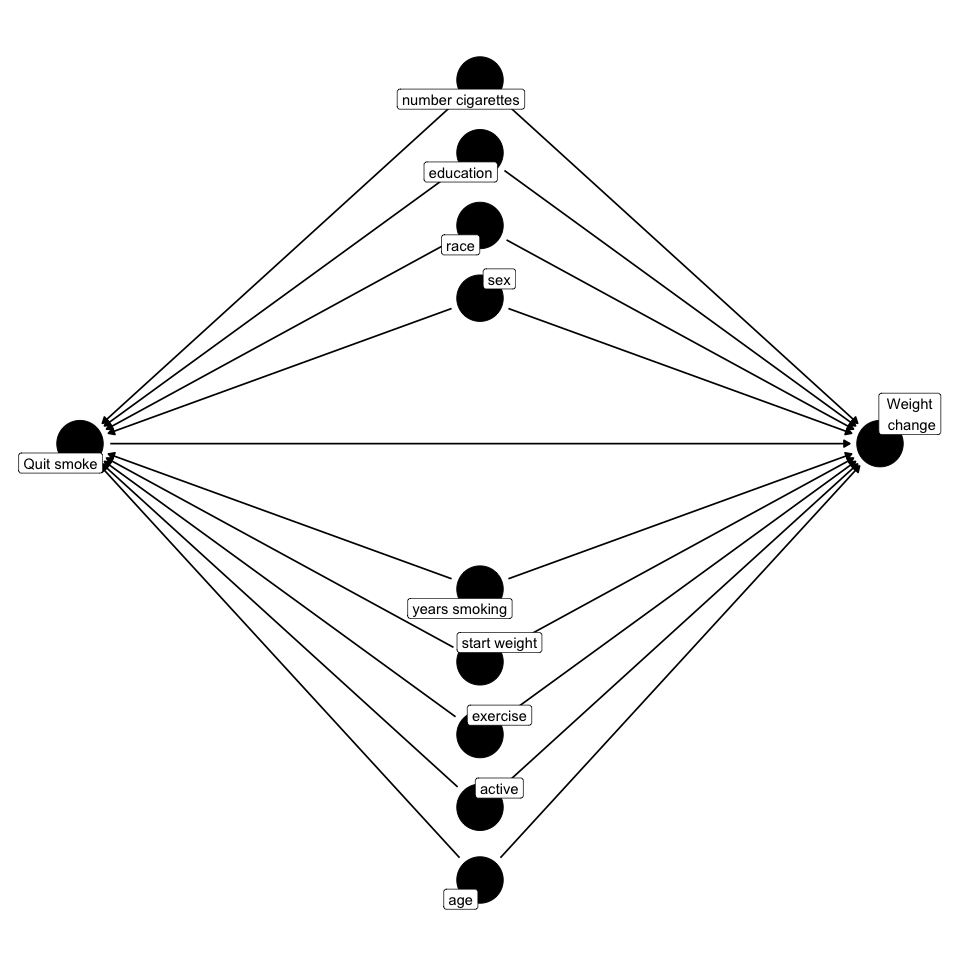

<!-- README.md is generated from README.Rmd. Please edit that file -->

# CarefullyCausal

<!-- badges: start -->
<!-- badges: end -->

The goal of CarefullyCausal is to provide the user a practical guide
when doing causal analyses. Particularly, CarefullyCausal provides the
user the estimand, a table of causal estimates, a discussion on the
causal assumptions, relevant diagnostics and
interpretations/explanations. The key aspects of a causal analyses are
printed and discussed in detail to help the user in evaluating whether
the estimated effects can be interpreted as being causal. Currently,
CarefullyCausal can be used in a setting with a fixed-exposure, meaning
that the exposure does not vary over time.  

Some key features:  

- **Setting**: Fixed-exposure
- **Outcome of interest**: can be dichotomous or continuous
- **Exposure of interest**: can be dichotomous, multi-value (max 4
  levels) or continuous
- **Effect measures**: can be in log(odds), risk ratio or odds ratio

## Installation

You can install the development version of CarefullyCausal as follows:

``` r
# To download R packages from Github or other sources we need the "devtools" package
install.packages("devtools")
library("devtools")

# Now we can download the CarefullyCausal package
install_github("mauricekorf/CarefullyCausal")
library(CarefullyCausal)
```

## Example

To develop some intuition with the CarefullyCausal function and to
highlight some important features, an example is step-by-step
illustrated using the NHEFS[^1] data set.

### Research Question

Suppose that we are interested in the causal relation between quitting
smoking and weight change (in Kilograms). Specifically,we would like to
know the effect of quitting smoking on someone’s weight change. In order
to evaluate this causal relation, we assume that there are some
important confounders we need to adjust for, which includes:  
sex, race, age, education level, smoke intensity (number of cigarettes
per day), how long someone has been smoking ( in years), start weight
(in Kilograms), how much someone exercises (**0:** much exercise, **1:**
moderate exercise, **2:** no exercise) and how active a person is on a
usual day (**0:** very active, **1:** moderately active, **2:**
inactive)

<br> Given that we assume that these are the only confounders and that
no collider bias or selection bias is induced, we would obtain the
following simple Directed Acyclic Graph (DAG):
<p align="center">

</p>
<center>
<i>Figure 1: </i>The selected variables are for illustration purposes
only. The DAG shows by no means the true causal structure
</center>

<br>

### Data

In order to answer our research question, we will use a subset of the
NHEFS data set from Hernán MA & Robins JM (2020) in the *Causal
inference: What if* book[^2]. To conveniently import this data set we
will use the package *causaldata*.

``` r
# Download the required package, containing various (causal) data sets
install.packages("causaldata")
library(causaldata)

# Load in the data, we will use the complete cases variant
df = nhefs_complete
```

<br>

We will now select the variables that we deemed to be relevant, as shown
in Figure 1 (DAG). We show the first six rows of the data set below, to
get an idea of the data set.

``` r
# Select variables
df = nhefs_complete[,c("wt82_71","qsmk","race","sex","education","smokeintensity", "smokeyrs","wt71","exercise","active", "age")]
```

<table>
<thead>
<tr>
<th style="text-align:right;">
wt82_71
</th>
<th style="text-align:right;">
qsmk
</th>
<th style="text-align:left;">
race
</th>
<th style="text-align:left;">
sex
</th>
<th style="text-align:left;">
education
</th>
<th style="text-align:right;">
smokeintensity
</th>
<th style="text-align:right;">
smokeyrs
</th>
<th style="text-align:right;">
wt71
</th>
<th style="text-align:left;">
exercise
</th>
<th style="text-align:left;">
active
</th>
<th style="text-align:right;">
age
</th>
</tr>
</thead>
<tbody>
<tr>
<td style="text-align:right;">
-10.093960
</td>
<td style="text-align:right;">
0
</td>
<td style="text-align:left;">
1
</td>
<td style="text-align:left;">
0
</td>
<td style="text-align:left;">
1
</td>
<td style="text-align:right;">
30
</td>
<td style="text-align:right;">
29
</td>
<td style="text-align:right;">
79.04
</td>
<td style="text-align:left;">
2
</td>
<td style="text-align:left;">
0
</td>
<td style="text-align:right;">
42
</td>
</tr>
<tr>
<td style="text-align:right;">
2.604970
</td>
<td style="text-align:right;">
0
</td>
<td style="text-align:left;">
0
</td>
<td style="text-align:left;">
0
</td>
<td style="text-align:left;">
2
</td>
<td style="text-align:right;">
20
</td>
<td style="text-align:right;">
24
</td>
<td style="text-align:right;">
58.63
</td>
<td style="text-align:left;">
0
</td>
<td style="text-align:left;">
0
</td>
<td style="text-align:right;">
36
</td>
</tr>
<tr>
<td style="text-align:right;">
9.414486
</td>
<td style="text-align:right;">
0
</td>
<td style="text-align:left;">
1
</td>
<td style="text-align:left;">
1
</td>
<td style="text-align:left;">
2
</td>
<td style="text-align:right;">
20
</td>
<td style="text-align:right;">
26
</td>
<td style="text-align:right;">
56.81
</td>
<td style="text-align:left;">
2
</td>
<td style="text-align:left;">
0
</td>
<td style="text-align:right;">
56
</td>
</tr>
<tr>
<td style="text-align:right;">
4.990117
</td>
<td style="text-align:right;">
0
</td>
<td style="text-align:left;">
1
</td>
<td style="text-align:left;">
0
</td>
<td style="text-align:left;">
1
</td>
<td style="text-align:right;">
3
</td>
<td style="text-align:right;">
53
</td>
<td style="text-align:right;">
59.42
</td>
<td style="text-align:left;">
2
</td>
<td style="text-align:left;">
1
</td>
<td style="text-align:right;">
68
</td>
</tr>
<tr>
<td style="text-align:right;">
4.989251
</td>
<td style="text-align:right;">
0
</td>
<td style="text-align:left;">
0
</td>
<td style="text-align:left;">
0
</td>
<td style="text-align:left;">
2
</td>
<td style="text-align:right;">
20
</td>
<td style="text-align:right;">
19
</td>
<td style="text-align:right;">
87.09
</td>
<td style="text-align:left;">
1
</td>
<td style="text-align:left;">
1
</td>
<td style="text-align:right;">
40
</td>
</tr>
<tr>
<td style="text-align:right;">
4.419060
</td>
<td style="text-align:right;">
0
</td>
<td style="text-align:left;">
1
</td>
<td style="text-align:left;">
1
</td>
<td style="text-align:left;">
2
</td>
<td style="text-align:right;">
10
</td>
<td style="text-align:right;">
21
</td>
<td style="text-align:right;">
99.00
</td>
<td style="text-align:left;">
1
</td>
<td style="text-align:left;">
1
</td>
<td style="text-align:right;">
43
</td>
</tr>
</tbody>
</table>

<br>

To further inspect the variable coding and the corresponding definition
we will create a table including the class of the variable.
<center>
<table>
<thead>
<tr>
<th style="text-align:left;">
variable
</th>
<th style="text-align:left;">
class
</th>
<th style="text-align:left;">
description
</th>
</tr>
</thead>
<tbody>
<tr>
<td style="text-align:left;">
wt82_71
</td>
<td style="text-align:left;">
numeric
</td>
<td style="text-align:left;">
The weight change between 1971 and 1982 in Kg
</td>
</tr>
<tr>
<td style="text-align:left;">
qsmk
</td>
<td style="text-align:left;">
numeric
</td>
<td style="text-align:left;">
Quit smoking, 1: yes, 0: no
</td>
</tr>
<tr>
<td style="text-align:left;">
race
</td>
<td style="text-align:left;">
factor
</td>
<td style="text-align:left;">
1: black or other, 0: white,
</td>
</tr>
<tr>
<td style="text-align:left;">
sex
</td>
<td style="text-align:left;">
factor
</td>
<td style="text-align:left;">
1: female, 0: male
</td>
</tr>
<tr>
<td style="text-align:left;">
education
</td>
<td style="text-align:left;">
factor
</td>
<td style="text-align:left;">
1: 8th grade, 2: HS dropout, 3: HS, 4: college dropout, 5: college or
higher
</td>
</tr>
<tr>
<td style="text-align:left;">
smokeintensity
</td>
<td style="text-align:left;">
numeric
</td>
<td style="text-align:left;">
Number of cigarettes smoked per day in 1971
</td>
</tr>
<tr>
<td style="text-align:left;">
smokeyrs
</td>
<td style="text-align:left;">
numeric
</td>
<td style="text-align:left;">
Years of smoking
</td>
</tr>
<tr>
<td style="text-align:left;">
wt71
</td>
<td style="text-align:left;">
numeric
</td>
<td style="text-align:left;">
Start weight (Kg) in 1971
</td>
</tr>
<tr>
<td style="text-align:left;">
exercise
</td>
<td style="text-align:left;">
factor
</td>
<td style="text-align:left;">
In recreation in 1971 how mu h exercising, 0: much, 1: moderate, 2:
little or none
</td>
</tr>
<tr>
<td style="text-align:left;">
active
</td>
<td style="text-align:left;">
factor
</td>
<td style="text-align:left;">
On usual day how active in 1971, 0: very active, 1: moderately active,
2: inactive
</td>
</tr>
<tr>
<td style="text-align:left;">
age
</td>
<td style="text-align:left;">
numeric
</td>
<td style="text-align:left;">
Age in 1971
</td>
</tr>
</tbody>
</table>
</center>

<br>

### Analysis (Applying CarefullyCausal)

We will now shift our focus to actually using the CarefullyCausal
function. The minimal call requires us to specify the following
arguments: `formula, data, family and exposure`. Note that you can
always consult the help file within R to see the documentation of
CarefullyCausal and to learn about all available arguments including an
explanation. You can access this by simply typing in *CarefullyCausal*
in the help tab in R. Nonetheless, we summarise the key arguments we
need for the minimal call.

- `Formula`, this has the same form as for example when using *glm*
  which is $y\sim x + w$. Here $y$ denotes the outcome of interest
  variable, $x$ denotes the exposure and $w$ is a covariate we want to
  adjust for
- `Data`, specify the data frame (data set)
- `Family`, this is the same as in *glm* where it describes the error
  distribution and link function. Here we have two choices: `"gaussian"`
  or `"binomial"`. This depends on the nature of the outcome of
  interest. In our example the outcome is continuous and thus we use the
  `"gaussian"` argument (default setting)
- `Exposure`, we explicitly define our exposure variable as a character
  string. In this example, it will be `"qsmk"`

``` r
# Transform exposure in a factor variable and transform into dataframe
df$qsmk = as.factor(df$qsmk) 
df = as.data.frame(df)

# Run the CarefullyCausal function and save it in the object "output"
output <- CarefullyCausal(wt82_71 ~ qsmk + race + sex + education + smokeintensity + smokeyrs + wt71 + exercise
                          + active + age,
                          data = df,
                          exposure = "qsmk",
                          family = "gaussian")
# Print the output
output
#> 
#> Estimand: 
#> Conditional 
#> E[wt82_71^qsmk=1|race, sex, education, smokeintensity, smokeyrs, wt71, exercise, active, age]  -  E[wt82_71^qsmk=0|race, sex, education, smokeintensity, smokeyrs, wt71, exercise, active, age]
#> 
#> Marginal 
#> E[wt82_71^qsmk=1]  -  E[wt82_71^qsmk=0]
#> *Please see output at $Estimand_interpretation for details 
#>  
#> 
#> Treatment effect: 
#>                          Estimate Std. Error S-value 95%.CI.lower 95%.CI.upper
#> qsmk1 outcome regression    3.381      0.441  44.858        2.517        4.246
#> qsmk1 IPTW                  3.318      0.494  35.198        2.351        4.286
#> qsmk1 S-standardization     3.381      0.454     Inf        2.490        4.270
#> qsmk1 T-standardization     3.448      0.419     Inf        2.603        4.244
#> qsmk1 TMLE                  3.370      0.494     Inf        2.401        4.339
#> 
#> Reference exposure level: 0 
#> 
#> 
#> Please evaluate whether the difference beteen the lowest estimate: 3.3183 and highest: 3.4482 is of substance, 
#> given the nature of the data. If so, evaluate the different modelling assumptions.
#> 
#> 
#> To interpret these effects as causal, the following key assumptions must be satisfied: 
#> 
#> [1] Conditional exchangeability: implies that adjusting for "race, sex, education, smokeintensity, smokeyrs, wt71, exercise, active, age" is enough to completely eliminate 
#> all confounding and selection bias. See the covariate balance table ($Assumptions$exchangeability$covariate_balance) 
#> in the saved output and the corresponding explanations ($Assumptions$exchangeability$explanation). 
#> 
#> [2] Positivity: is satisfied when both exposed and unexposed individuals are observed within every stratum of variables adjusted for ( race, sex, education, smokeintensity, smokeyrs, wt71, exercise, active, age ). This can be evaluated using the propensity plots saved in the output at $Assumptions$positivity$plots (or identically use the ps.plot() function), the table below ($Assumptions$positivity$ps_table) and the corresponding explanation found at $Assumptions$positivity$explanation. Note: PS=propensity score 
#>  
#>                        PS range for 1
#> observed exposure: 0   0.0338, 0.6520
#> observed exposure: 1   0.0685, 0.7709
#> 
#> [3] Consistency: implies that exposure 'qsmk' must be sufficiently well-defined so that any variation within 
#> the definition of the exposure would not result in a different outcome. See $Assumption$consistency 
#> for a more in-depth explanation and examples. 
#> 
#> [4] No measurement error: assumes that all variables were measured without substantial error, such that
#> no substantial measurement bias is present. However, if the presence of substantial measurement bias is plausible, 
#> then the estimated effects should be carefully reconsidered as being causal effects. See $Assumptions$no_measurement_error 
#> for a further discussion 
#> 
#> [5] Well-specified models: assumes that any models used are well-specified meaning that they include all
#> relevant non-linearities and/or statistical interactions
```

<br>

The output of the CarefullyCausal function is shown above and can be
broadly classified into the sections: estimand, estimators and
assumptions/diagnostics. We go over each part now in more detail.

##### Estimand

The first lines in the output show the *estimand*, which is a precise
description of your research question. Ideally, this should be decided
on before the analysis. Nonetheless, by showing the estimand it may
ideally help you double-check your research question and whether this is
in line with what you are estimating as shown by the estimand. Moreover,
it should be noted that the estimand is in counterfactual notation and
thus explicitly emphasizes that we are interested in causal effects. We
provide both a conditional and marginal estimand since we provide
different estimators and different type of estimands correspond to
different estimators. In essence, the idea of the estimand is the same
but due to more technical reasons (how the estimators work) we write the
estimand in a conditional or marginal way. Important to note is that the
marginal estimand is still adjusting for all the variables like shown in
the conditional estimand, but we do not write the adjusted variables
explicitly in the marginal estimand. To learn more about estimands and
its formulation: [^3] [^4] [^5]

``` r
#> Estimand: 
#> Conditional 
#> E[wt82_71^qsmk=1|race, sex, education, smokeintensity, smokeyrs, wt71, exercise, active, age]  - E[wt82_71^qsmk=0|race, sex, education, smokeintensity, smokeyrs, wt71, exercise, active, age]
#> 
#> Marginal 
#> E[wt82_71^qsmk=1]  -  E[wt82_71^qsmk=0]
#> *Please see output at $Estimand_interpretation for details 
```

<br>

We can obtain a description of the estimand from the saved output, in
this example the CarefullyCausal output was saved in the object named
*output*. Hence, we call the specific output object.

``` r
# Show saved output from $Estimand_interpretation
output$Estimand_interpretation

#> [1] "The estimand shows the average causal effect in the population of interest given the different exposure
#> regimes. More specifically, the effect of receiving exposure level 1 with respect to the reference exposure
#> level 0. When adjusting for a set of covariates (race, sex, education, smokeintensity, smokeyrs, wt71,
#> exercise, active, age) the estimand is displayed in either a conditional or marginal way. Particularly,
#> defining the estimand depends on the approach/model used. For example, outcome regression has a conditional
#> estimand while IPTW has a marginal estimand. The T-standardization approach also has a marginal estimand
#> while for the S-standardization it depends on whether interactions between treatment and covariates are
#> taken into account. When no interactions are considered, then it is the same as outcome regression and
#> thus has a conditional estimand, however when all interactions are considered then it is like
#> T-standardization and thus has a marginal estimand."
```

<br>

##### Estimators

After the estimand, the estimates are shown in a table including the
standard errors, s-value and 95% confidence interval. The p-value can
also be shown by setting `pvalue=TRUE`, but is hidden by default. The
S-value is a transformation of the p-value by applying
$-log_2(p-value)$. The S-value is continuum and ranges from 0 to
infinity, where a p-value of 1 corresponds to a S-value of 0 and a
p-value of 0 corresponds to a S-value approaching infinity. Intuitively,
the S-value captures the amount of information in the data against the
model and quantifies how *suprised* we can be about a specific outome.
In other words, a very high S-value implies that we would be suprised by
the findings we found, given all background assumptions and test
hypotheses. Showing the S-value by default rather than the p-value is
motivated by that in practice a lot of studies dichotomize settings
based on a single cut-off value (e.g. $0.05$) where below that value it
is interpreted as *useful* and above it is interpreted as *not useful*.
In this way the focus is generally purely on the statistical
significance and tends to result in underacknowledgment of the practical
significance.[^6] [^7] [^8]

CarefullyCausal currently supports five different estimators, as shown
below, where key characteristics are listed below:

- *Outcome Regression*: for outcome regression `glm` is implemented.
  When `family = "gaussian"` linear regression is by default performed
  and when `family = "binomial"` logistic regression will be
  implemented.
- *Inverse Probability Treatment Weighting (IPTW)*: Propensity scores
  are estimated using the `CBPS` package, which are *Covariate Balancing
  Propensity Scores*[^9]. Technical details about how *CBPS* works can
  be found for binary exposure[^10], for multi-value exposure[^11] and
  for continuous exposure[^12]. Based on the estimated propensity
  scores, *non-stabilized* weights (*IP weights*) will be computed.
  Subsequently, the `svyglm` function from the `survey` package is used
  to run a weighted glm with the IP weights to get the correct
  corresponding standard errors. By default `CBPS` is implemented, but
  the user can also input their own *IP weights* as a vector using the
  `ip_weights_iptw` argument and offers fully flexibility.
- *S-and-T-standardization*: these two approaches are generally referred
  within the causal inference literature to the broad approach of
  *standardization* (G-computation). In CarefullyCausal an explicit
  distinction is made between different standardization approaches,
  hence the two different namings. The names are inspired by the machine
  learning literature where similar ideas are generalized and clear
  distinctions are made between different approaches such as the
  S-learner and T-learner[^13]. The S-learner and T-learner can be
  viewed as two different standardization approaches where the S-learner
  uses a single model and the T-learner uses two models. Specifically,
  with the S-learner a single model is fitted on all data and then the
  counterfactual effects are predicted under all exposure levels. In
  contrast, the T-learner first splits the data based on the exposure
  variable and then fits a model per exposure level. Each model is then
  used to predict the counterfactual effects for the entire sample under
  each exposure level. To make a clear link to the causal inference
  terminology, we introduced the names S-standardization and
  T-standardization. A user can add interactions in the
  S-standardization model between a covariate and exposure using the
  `interaction` argument. When no interactions are included it will be
  equivalent to outcome regression and when all possible interactions
  are considered between the adjustment set and exposure it is
  equivalent to T-standardization. Currently, CarefullyCausal only
  supports `glm`. Bootstrapping is used to obtain standard errors and
  the p-value and are controlled by arguments `boot1` and `boot2`.
  Moreover, a normal confidence interval or bias-corrected accelerated
  confidence interval can be computed using `confidence`. These
  estimators do not support a continuous exposure.
- *Targeted Maximum Likelihood Estimation*:

``` r
#> Treatment effect: 
#>                       Estimate Std. Error S-value 95%.CI.lower 95%.CI.upper
#> qsmk1 outcome regression    3.381      0.441  44.858        2.517        4.246
#> qsmk1 IPTW                  3.318      0.494  35.198        2.351        4.286
#> qsmk1 S-standardization     3.381      0.549     Inf        2.194        4.344
#> qsmk1 T-standardization     3.448      0.523     Inf        2.479        4.528
#> qsmk1 TMLE                  3.370      0.494     Inf        2.401        4.339

#> Reference exposure level: 0 


#> Please evaluate whether the difference beteen the lowest estimate: 3.3183 and highest: 3.4482 is of substance, 
#> given the nature of the data. If so, evaluate the different modelling assumptions.
```

<br>

[^1]: National Health and Nutrition Examination Survey Data I
    Epidemiologic Follow-up Study,
    <https://wwwn.cdc.gov/nchs/nhanes/nhefs/>

[^2]: Hernán MA, Robins JM (2020). Causal Inference: What If. Boca
    Raton: Chapman &
    Hall/CRC,<https://www.hsph.harvard.edu/miguel-hernan/causal-inference-book/>

[^3]: Luijken, K., van Eekelen, R., Gardarsdottir, H., Groenwold, R. H.,
    & van Geloven, N. (2023). Tell me what you want, what you really
    really want: Estimands in observational pharmacoepidemiologic
    comparative effectiveness and safety studies. Pharmacoepidemiology
    and Drug Safety.

[^4]: Goetghebeur, E., le Cessie, S., De Stavola, B., Moodie, E. E.,
    Waernbaum, I., & ” the topic group Causal Inference (TG7) of the
    STRATOS initiative. (2020). Formulating causal questions and
    principled statistical answers. Statistics in medicine, 39(30),
    4922-4948.

[^5]: Kahan, B. C., Cro, S., Li, F., & Harhay, M. O. (2023). Eliminating
    ambiguous treatment effects using estimands. American Journal of
    Epidemiology, 192(6), 987-994.

[^6]: Rose-Nussbaumer, J. (2021). Statistical Significance vs Clinical
    Significance—That Is the Question. JAMA ophthalmology, 139(11),
    1235-1235.

[^7]: Greenland, S., Senn, S. J., Rothman, K. J., Carlin, J. B., Poole,
    C., Goodman, S. N., & Altman, D. G. (2016). Statistical tests, P
    values, confidence intervals, and power: a guide to
    misinterpretations. European journal of epidemiology, 31, 337-350.

[^8]: 14\. Greenland, S. (2019). Valid p-values behave exactly as they
    should: Some misleading criticisms of p-values and their resolution
    with s-values. The American Statistician, 73(sup1), 106-114

[^9]: Fong C, Ratkovic M, Imai K (2022). *CBPS: Covariate Balancing
    Propensity Score*. R package version0.23,
    <https://CRAN.R-project.org/package=CBPS>.

[^10]: Imai, K., & Ratkovic, M. (2014). Covariate balancing propensity
    score. Journal of the Royal Statistical Society Series B:
    Statistical Methodology, 76(1), 243-263.

[^11]: Imai, K., & Ratkovic, M. (2015). Robust estimation of inverse
    probability weights for marginal structural models. Journal of the
    American Statistical Association, 110(511), 1013-1023.

[^12]: Fong, C., Hazlett, C., & Imai, K. (2018). Covariate balancing
    propensity score for a continuous treatment: Application to the
    efficacy of political advertisements. The Annals of Applied
    Statistics, 12(1), 156-177.

[^13]: Künzel, S. R., Sekhon, J. S., Bickel, P. J., & Yu, B. (2019).
    Metalearners for estimating heterogeneous treatment effects using
    machine learning. Proceedings of the national academy of sciences,
    116(10), 4156-4165.
